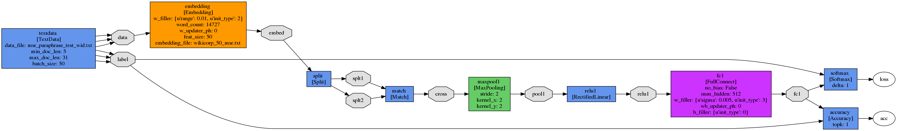

Model Configuration File Description (JSON)
====
We use JSON as a protocol of our model. We describe each sections meaning below.

First let's list a simple example here:



```json
{
   "global" : {
      "w_updater_ph" : {
        "w_updater" : {
           "decay" : 0.01,
           "lr" : 0.01,
           "updater_type" : "SGD"
        }
      },
      "wb_updater_ph" : {
        "b_updater" : {
           "decay" : 0.01,
           "lr" : 0.01,
           "updater_type" : "SGD"
        },
        "w_updater" : {
           "decay" : 0.01,
           "lr" : 0.01,
           "updater_type" : "SGD"
        }
      }
   },
   
   "net_name" : "simple_net",
   "net_config" : [
      {
		  "tag" : "Train",
          "max_iters" : 10000,
          "display_interval": 1,
		  "save_interval": 1000,
		  "save_name": "weights/matching_net_arc2",
          "out_nodes" : ["loss"]
	  },
	  {
		  "tag" : "Valid",
          "max_iters" : 34,
          "display_interval" : 100,
		  "save_interval" : 0,
		  "save_name" : "",
          "out_nodes" : ["loss", "acc"]
	  },
	  {
		  "tag" : "Test",
          "max_iters" : 34,
          "display_interval" : 100,
		  "save_interval" : 0,
		  "save_name" : "",
          "out_nodes" : ["loss", "acc"]
	  }
   ],

   "layers" : [
      {
         "bottom_nodes" : null,
         "layer_idx" : 0,
         "layer_name" : "textdata",
         "layer_type" : 71,
         "setting" : {
            "batch_size" : 50,
            "data_file" : "msr_paraphrase_local_train_wid_dup.txt",
            "max_doc_len" : 31,
            "min_doc_len" : 5
         },
         "top_nodes" : [ "data", "label" ],
         "tag" : ["Train"]
      },
      {
         "bottom_nodes" : null,
         "layer_idx" : 0,
         "layer_name" : "textdata",
         "layer_type" : 71,
         "setting" : {
            "batch_size" : 50,
            "data_file" : "msr_paraphrase_local_valid_wid.txt",
            "max_doc_len" : 31,
            "min_doc_len" : 5
         },
         "top_nodes" : [ "data", "label" ],
         "tag" : ["Valid"]
      },
      {
         "bottom_nodes" : null,
         "layer_idx" : 0,
         "layer_name" : "textdata",
         "layer_type" : 71,
         "setting" : {
            "batch_size" : 50,
            "data_file" : "msr_paraphrase_test_wid.txt",
            "max_doc_len" : 31,
            "min_doc_len" : 5
         },
         "top_nodes" : [ "data", "label" ],
         "tag" : ["Test"]
      },
	  {
         "bottom_nodes" : [ "data" ],
         "layer_idx" : 1,
         "layer_name" : "embedding",
         "layer_type" : 21,
         "setting" : {
            "embedding_file" : "wikicorp_50_msr.txt",
            "feat_size" : 50,
            "w_filler" : {
               "init_type" : 2,
               "range" : 0.01
            },
            "w_updater_ph" : 0,
            "word_count" : 14727
         },
         "top_nodes" : [ "embed" ]
      },
      {
         "bottom_nodes" : [ "embed" ],
         "layer_idx" : 2,
         "layer_name" : "split",
         "layer_type" : 20,
         "setting" : null,
         "top_nodes" : [ "splt1", "splt2" ]
      },
      {
         "bottom_nodes" : [ "splt1", "splt2" ],
         "layer_idx" : 5,
         "layer_name" : "match",
         "layer_type" : 23,
         "setting" : null,
         "top_nodes" : [ "cross" ]
      },
      {
         "bottom_nodes" : [ "cross" ],
         "layer_idx" : 6,
         "layer_name" : "maxpool1",
         "layer_type" : 15,
         "setting" : {
            "kernel_x" : 2,
            "kernel_y" : 2,
            "stride" : 2
         },
         "top_nodes" : [ "pool1" ]
      },
      {
         "bottom_nodes" : [ "pool1" ],
         "layer_idx" : 7,
         "layer_name" : "relu1",
         "layer_type" : 1,
         "setting" : null,
         "top_nodes" : [ "relu1" ]
      },
      {
         "bottom_nodes" : [ "relu1" ],
         "layer_idx" : 14,
         "layer_name" : "fc1",
         "layer_type" : 11,
         "setting" : {
            "b_filler" : {
               "init_type" : 0
            },
            "no_bias" : false,
            "num_hidden" : 512,
            "w_filler" : {
               "init_type" : 3,
               "sigma" : 0.005
            },
            "wb_updater_ph" : 0
         },
         "top_nodes" : [ "fc1" ]
      },
      {
         "bottom_nodes" : [ "fc1", "label" ],
         "layer_idx" : 18,
         "layer_name" : "softmax",
         "layer_type" : 51,
         "setting" : {
            "delta" : 1
         },
         "top_nodes" : [ "loss" ]
      },
      {
         "bottom_nodes" : [ "fc1", "label" ],
         "layer_idx" : 18,
         "layer_name" : "accuracy",
         "layer_type" : 56,
         "setting" : {
            "topk" : 1
         },
         "top_nodes" : [ "acc" ],
         "tag" : ["Valid", "Test"]
      }
   ]
   
}
```